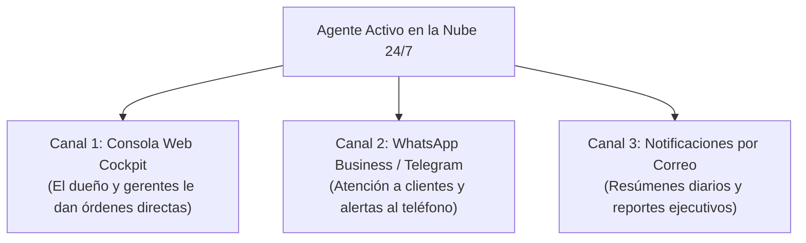

# 🛡️ Manual Oficial de Despliegue y Activación 24/7 en la Nube
## Guía de Onboarding Corporativo para Clientes — Destraba AI / Unblock AI

> **Para Directores Ejecutivos, Gerentes Generales y Equipos de Operaciones**  
> *"Erradica tus cuellos de botella operativos en 60 segundos. Tu agente inteligente ya está listo para trabajar en la nube 24/7 sin interrumpir tu jornada."*

---

## 🏛️ 1. Introducción y Bienvenida

Estimado Cliente:

Bienvenido a **Destraba AI**. Tu suscripción fiduciaria ha sido confirmada y tu agente autónomo ha sido sintetizado bajo los estándares de máxima seguridad empresarial con **Google Gemini Flash 2.5**.

A diferencia de los chatbots tradicionales que requieren servidores locales, computadoras encendidas o configuraciones técnicas complejas, tu agente opera bajo una **Arquitectura Cloud-Native 24/7**:
* **Cero Instalaciones Locales:** Vive permanentemente en nuestra infraestructura en la nube.
* **Disponibilidad Ininterrumpida:** Trabaja de noche, fines de semana y feriados.
* **Seguridad Bancaria:** Memoria volátil aislada en RAM y cifrado TLS 1.3 de grado financiero.

Este manual describe el procedimiento exacto de 3 pasos para poner a tu agente en producción en menos de 3 minutos.

---

## 📬 2. Paso 1: Recepción de tu Credencial Fiduciaria por Correo

Al completar tu pago a través de **Wompi SV** (Tarjeta Bancaria Internacional) o **Strike Lightning** (Bitcoin / USD), el sistema fiduciario despacha un correo electrónico formal desde `soporte@destraba.ai` con el asunto:

> `🛡️ Paquete de Activación y Licencia Fiduciaria 24/7 — [Nombre de tu Empresa]`

### ¿Qué contiene este correo?
1. **Tu Número de Licencia Fiduciaria (License ID):** Un identificador alfanumérico único para auditoría contable (ejemplo: `LIC-WOMPI-984210`).
2. **Enlace de Activación en 1 Clic:** Un botón de acceso directo seguro que abre tu plataforma en la nube precargando los permisos de tu agente.
3. **Paquete Soberano Adjunto (`.zip`):** Una copia de seguridad que contiene la arquitectura completa de tu agente (formato `.agents`) por si tu equipo de informática o TI requiere auditar el código o correrlo en **Google Antigravity** / **Cursor**.

---

## 🌐 3. Paso 2: Activación en la Plataforma en la Nube (60 Segundos)

### Método A: Activación Automática (Recomendado)
1. Abre el correo de bienvenida y haz clic en el botón:  
   **`🚀 Activar mi Agente en la Plataforma Cloud 24/7`**.
2. Tu navegador abrirá automáticamente la plataforma en:  
   `https://destraba-ai.vercel.app/?licencia=TU_CODIGO&plan=TU_PLAN`
3. La plataforma detectará tu licencia de inmediato y desplegará la **Cabina de Bienvenida Corporativa**:
   * Verás el nombre de tu agente asignado (Soporte, Ventas B2B, Cobranza, Inventario o Mercadeo).
   * Verás el estado de tu licencia: `🟢 VERIFICADA Y ACTIVA`.

### Método B: Activación Manual mediante Carga de Paquete (.zip)
Si prefieres ingresar directamente o abrir una sesión nueva:
1. Ingresa a [https://destraba-ai.vercel.app](https://destraba-ai.vercel.app).
2. En la barra superior, haz clic en **`Portal: Ingresar`**.
3. Selecciona la opción **`📦 Cargar Paquete de Agente (.zip)`**.
4. Arrastra el archivo `.zip` que recibiste adjunto en tu correo.
5. El sistema lo desempaquetará en memoria y activará la sesión en la nube al instante.

---

## ⚙️ 4. Paso 3: Configuración de Canales Operativos

Una vez activado en la plataforma, defines cómo interactuará tu agente con tu empresa:

### 1. Operación desde la Consola Web (Cockpit):
* En la pantalla principal de la plataforma, pulsa **`🤖 Consola del Agente en Vivo`**.
* Se abrirá el chat interactivo donde podrás darle instrucciones ejecutivas en español o inglés:
  * *"Agente, redacta una plantilla de cobranza cortés para clientes con 15 días de mora."*
  * *"Agente, clasifica estos tres prospectos entrantes y dime cuál tiene mayor intención de compra."*
  * *"Agente, genera el informe de cierre del día."*

### 2. Vinculación de WhatsApp o Telegram (Opcional):
* En el menú **`Configuración ⚙️`**, puedes ingresar el Webhook o token de tu canal para que tu agente responda automáticamente a tus clientes cuando escriban a tu línea de empresa.

---

## 📊 5. Matriz de Agentes y Roles en Producción

| Agente Oficial | Rol y Misión | Entregables en la Nube |
| :--- | :--- | :--- |
| **💬 Soporte & Concierge** | Atención inmediata a preguntas frecuentes, cotizaciones estándar y triaje de reclamos. | Respuestas en < 3s, filtrado de urgencias y reducción del 80% de llamadas repetitivas. |
| **💼 Ventas Outbound B2B** | Calificación de leads, cadencias de 3 impactos y despacho de links de cobro seguros. | Pipeline activo, cotizaciones en 60 segundos y cobro inmediato vía Wompi/Strike. |
| **📊 Cobranza & Conciliación** | Auditoría de facturas vs. extractos bancarios, recordatorios y mitigación de cartera morosa. | Conciliación matemática, avisos corteses automáticos y reducción del DSO. |
| **🚚 Control de Inventarios** | Monitoreo de existencias mínimas, cruce físico vs. digital y alertas tempranas de stock. | Prevención de quiebres de inventario y notificación proactiva a clientes. |
| **📢 Directora de Mercadeo** | Estrategia de posicionamiento, copys de autoridad y distribución de contenidos. | Publicaciones estructuradas para LinkedIn y Buffer con enfoque fiduciario. |

---

## 🔒 6. Seguridad de la Información y Cumplimiento

* **Privacidad de Grado Bancario (SOC-2 Compliance):** Tus datos no se utilizan para reentrenar modelos públicos de inteligencia artificial.
* **Procesamiento Volátil:** La plataforma no almacena archivos temporales en disco físico; todo opera en memoria volátil de alta velocidad y se purga de forma segura.
* **Propiedad Intelectual Soberana:** El archivo `.agents` entregado en tu paquete `.zip` es de tu propiedad exclusiva y contiene las instrucciones maestras y directivas de tu empresa.

---

## 🆘 7. Canal de Soporte Técnico y Garantía Fiduciaria

Si requieres asistencia técnica, cambio de clave maestra o integración con sistemas internos (ERP, bases de datos o pasarelas locales):

* **Correo Oficial de Soporte Corporativo:**  
  📧 [`soporte@destraba.ai`](mailto:soporte@destraba.ai)
* **Atención Directa de Ingeniería:**  
  Menos de 4 horas hábiles de respuesta garantizada.
* **Garantía de Satisfacción Fiduciaria:**  
  Si durante los primeros 7 días tu agente no ha optimizado los tiempos operativos de tu negocio, cancelas tu suscripción con un solo clic sin penalizaciones ni letras pequeñas.

---
*Destraba AI / Unblock AI — Plataforma Fiduciaria de Custom Agents Desatendidos*  
*San Salvador, El Salvador • Operaciones Internacionales en USD*
