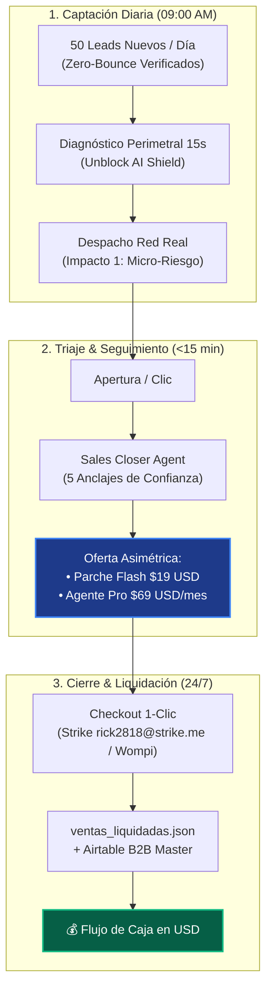
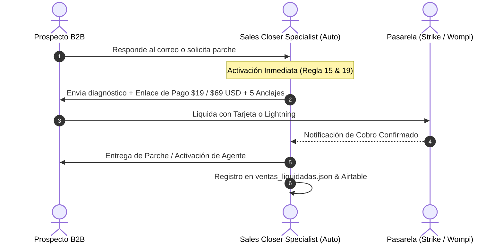

# 🎯 Plan Maestro de Ejecución Comercial: Despegue Lunes 28 de Septiembre (09:00 AM)

> **Objetivo Supremo Fiduciario:** Quebrar el récord de $0 USD en ventas y establecer un flujo de caja recurrente en USD mediante prospección desatendida, micro-auditorías de alto impacto y liquidación fiduciaria instantánea (Strike Lightning & Wompi).

---

## 📊 Arquitectura del Embudo de Conversión



---

## 🗓️ Cronograma Diario de Ejecución Semanal

### 🔵 Lunes 28 de Septiembre (09:00 AM) — Sector Logística & Distribución (Centroamérica / El Salvador)

* **Hora de Inicio:** 09:00 AM local.
* **Target:** 50 Directores de Operaciones y TI en operadores 3PL, aduanas y centros de distribución.
* **Tesis de Dolor:** Desfase en confirmaciones WhatsApp, pérdida de visibilidad de guías y falta de cabeceras de seguridad en portales de tracking.
* **Oferta:**
  - **Plan Flash ($19 USD):** Auditoría Perimetral + Parche de Seguridad de Cabeceras HTTP / DNS listo en 60s.
  - **Plan Pro ($69 USD/mes):** Concierge Automatizado de Notificaciones y Rastreo 24/7.
* **Comandos & Scripts de Ejecución:**
  ```bash
  # 1. Extracción y Verificación Zero-Bounce de 50 leads
  node scripts/outbound/apollo_b2b_prospector.mjs --sector="logistics_ca" --limit=50
  
  # 2. Despacho en Red Real (09:15 AM)
  node scripts/outbound/master_fiduciary_b2b_engine.mjs --batch="lunes_logistica"
  ```
* **Métricas de Control (18:00 PM):**
  - Correos entregados a bandeja principal: >= 48 (>= 96%).
  - Aperturas únicas: >= 20 (>= 40%).
  - Respuestas / Solicitudes de informe: >= 3.

---

### 🟢 Martes 29 de Septiembre (09:00 AM) — E-Commerce & Retail B2B (Colombia)

* **Target:** 50 Líderes de E-commerce, Innovación y Facturación en Colombia.
* **Tesis de Dolor:** Abandono de carritos B2B, tiempos de respuesta lentos en pasarelas y conciliación manual de pagos.
* **Oferta:**
  - **Plan Flash ($19 USD):** Reporte de Rendimiento y Vulnerabilidad de Checkout.
  - **Plan Pro ($69 USD/mes):** Agente de Recuperación de Carritos y Conciliación Automática.
* **Comandos & Scripts:**
  ```bash
  node scripts/outbound/apollo_b2b_prospector.mjs --sector="ecommerce_colombia" --limit=50
  node scripts/outbound/master_fiduciary_b2b_engine.mjs --batch="martes_colombia"
  ```

---

### 🟣 Miércoles 30 de Septiembre (09:00 AM) — Software & Servicios Profesionales (España)

* **Target:** 50 CTOs, CIOs y Directores de Operaciones en España (alta penetración de IA).
* **Tesis de Dolor:** Sobrecarga de tickets Nivel 1 en soporte y filtrado manual de prospectos entrantes.
* **Oferta:**
  - **Plan Flash ($19 USD):** Escaneo perimetral de APIs y cabeceras bancarias.
  - **Plan Pro ($89 USD / $490 Enterprise):** Agente de Triaje y Calificación Desatendida.
* **Comandos & Scripts:**
  ```bash
  node scripts/outbound/apollo_b2b_prospector.mjs --sector="saas_espana" --limit=50
  node scripts/outbound/master_fiduciary_b2b_engine.mjs --batch="miercoles_espana"
  ```

---

### 🟡 Jueves 1 de Octubre (09:00 AM) — Fintechs & Servicios Financieros (Chile & México)

* **Target:** 50 Gerentes de Operaciones y Cobranza en Fintechs y servicios B2B.
* **Tesis de Dolor:** Cobranza manual de facturas vencidas y conciliación contable fragmentada.
* **Oferta:**
  - **Plan Flash ($19 USD):** Auditoría de Cumplimiento Perimetral y Parche Rápido.
  - **Plan Pro ($69 USD/mes):** Agente de Cobranza Preventiva y Cierre Fiduciario.
* **Comandos & Scripts:**
  ```bash
  node scripts/outbound/apollo_b2b_prospector.mjs --sector="fintech_latam" --limit=50
  node scripts/outbound/master_fiduciary_b2b_engine.mjs --batch="jueves_fintech"
  ```

---

### 🔴 Viernes 2 de Octubre (09:00 AM) — Ciberseguridad Defensiva Cross-Border (Global) & Arqueo Semanal

* **Target:** 50 CISOs, Oficiales de Seguridad y Directores de Infraestructura en empresas con operaciones cross-border.
* **Tesis de Dolor:** Puertos expuestos, fallas en políticas CSP/HSTS y riesgo de suplantación de identidad (DMARC/SPF).
* **Oferta:**
  - **Plan Flash ($19 USD):** Paquete de Parches Defensivos Listos para Despliegue en 60 Segundos.
  - **Plan Deep Shield ($89 USD):** Blindaje Integral Perimetral + Monitoreo 24/7.
* **Rutina de Cierre de Semana (17:00 PM):**
  - Arqueo fiduciario de `ventas_liquidadas.json`.
  - Evaluación de tasa de conversión por sector.
  - Ajuste de copys y filtrado para la siguiente semana.

---

## 🛡️ Protocolo de Cierre Desatendido en <15 Minutos



### Los 5 Anclajes de Confianza Obligatorios en Cada Contacto:
1. **Cero Invasión Previa:** No solicitamos contraseñas ni acceso a bases de datos. Diagnóstico 100% perimetral.
2. **Micro-Riesgo Asimétrico:** Parche descargable listo para producción por solo **$19 USD**.
3. **Garantía Incondicional de 7 Días:** Reembolso del 100% si no ahorra al menos 10 horas de trabajo.
4. **Privacidad Bancaria SOC-2:** Retención cero en disco, procesamiento 100% en RAM volátil.
5. **ROI Objetivo:** Agente 24/7 por $2.30 USD/día ($69 USD/mes), pagándose con 1 solo ticket recuperado.

---

## 📈 Metas y Cuadro de Mando Semanal

| Hito / Indicador | Meta Mínima Aceptable | Meta Objetivo |
| :--- | :--- | :--- |
| **Prospectos Contactados** | 200 leads | 250 leads (50/día) |
| **Tasa de Entrega a Bandeja Principal** | >= 95% | >= 98% |
| **Tasa de Apertura (Open Rate)** | >= 35% | >= 45% |
| **Tasa de Respuesta (Reply Rate)** | >= 8% | >= 15% |
| **Primeras Ventas Liquidadas** | >= 1 ($19 o $69 USD) | >= 5 ($300+ USD) |

---

## 🚀 Checklist de Preparación Previa (Antes del Lunes 09:00 AM)

- [x] **Dominio y DNS:** Cabeceras SPF, DKIM, DMARC y MX verificados en verde.
- [x] **Pasarelas de Pago:** Strike Lightning (`rick2818@strike.me`) y Wompi SV validados y operativos.
- [x] **Pipeline de Prospección:** Listados de Apollo con enriquecimiento Zero-Bounce en RAM preparados.
- [x] **Agente de Cierre:** Webhooks y auto-respondedores configurados para despachar en red real sin intervención manual.
- [x] **Ledger Inmutable:** `pipeline/ventas_liquidadas.json` y Airtable listos para registrar cada dólar ingresado.
