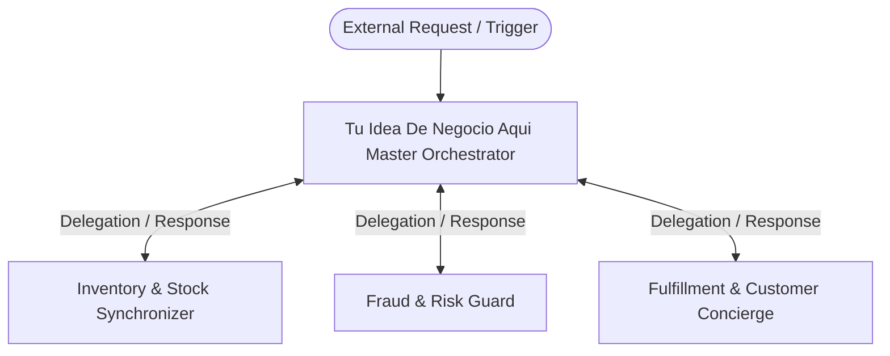

# Tu Idea De Negocio Aqui Autonomous Multi-Agent Specification

## 1. Executive Summary
Autonomous agent system tailored for E-Commerce / Retail. Addresses primary operational friction in 'Tu idea de negocio aqui...' through specialized multi-agent collaboration.

## 2. Multi-Agent Topology & Communication Graph

## 3. Communication Channels

| Channel ID | From | To | Protocol | Description |
| :--- | :--- | :--- | :--- | :--- |
| `chan-agent-orchestrator-to-subagent-inventory-and-stock-synchronizer` | `agent-orchestrator` | `subagent-inventory-and-stock-synchronizer` | `direct_rpc` | Task delegation and query channel from Orchestrator to Inventory & Stock Synchronizer. |
| `chan-subagent-inventory-and-stock-synchronizer-to-agent-orchestrator` | `subagent-inventory-and-stock-synchronizer` | `agent-orchestrator` | `escalation` | Results return, status updates, and anomaly escalation from Inventory & Stock Synchronizer. |
| `chan-agent-orchestrator-to-subagent-fraud-and-risk-guard` | `agent-orchestrator` | `subagent-fraud-and-risk-guard` | `direct_rpc` | Task delegation and query channel from Orchestrator to Fraud & Risk Guard. |
| `chan-subagent-fraud-and-risk-guard-to-agent-orchestrator` | `subagent-fraud-and-risk-guard` | `agent-orchestrator` | `escalation` | Results return, status updates, and anomaly escalation from Fraud & Risk Guard. |
| `chan-agent-orchestrator-to-subagent-fulfillment-and-customer-concierge` | `agent-orchestrator` | `subagent-fulfillment-and-customer-concierge` | `direct_rpc` | Task delegation and query channel from Orchestrator to Fulfillment & Customer Concierge. |
| `chan-subagent-fulfillment-and-customer-concierge-to-agent-orchestrator` | `subagent-fulfillment-and-customer-concierge` | `agent-orchestrator` | `escalation` | Results return, status updates, and anomaly escalation from Fulfillment & Customer Concierge. |
| `chan-system-broadcast` | `agent-orchestrator` | `*` | `pubsub_broadcast` | Global event broadcast bus for lifecycle changes and emergency halts. |

## 4. Domain Data Entities

- **Product SKU**: Primary domain resource representing product sku in the system. (Attributes: `id, status, created_at, metadata`)
- **Cart & Checkout**: Primary domain resource representing cart & checkout in the system. (Attributes: `id, status, created_at, metadata`)
- **Order & Payment**: Primary domain resource representing order & payment in the system. (Attributes: `id, status, created_at, metadata`)
- **Inventory Stock**: Primary domain resource representing inventory stock in the system. (Attributes: `id, status, created_at, metadata`)
- **Customer Lifetime Record**: Primary domain resource representing customer lifetime record in the system. (Attributes: `id, status, created_at, metadata`)
- **Shipping & Tracking**: Primary domain resource representing shipping & tracking in the system. (Attributes: `id, status, created_at, metadata`)

## 5. Security and Compliance Policies

- Principle of Least Privilege: Subagents only hold tools matching their exact scope.
- Two-Phase Commit for High Stakes: Irreversible write operations require approval or sandbox checks.
- Immutable Audit Logging: All inter-agent message exchanges and tool calls are recorded.
